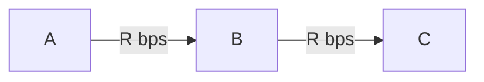
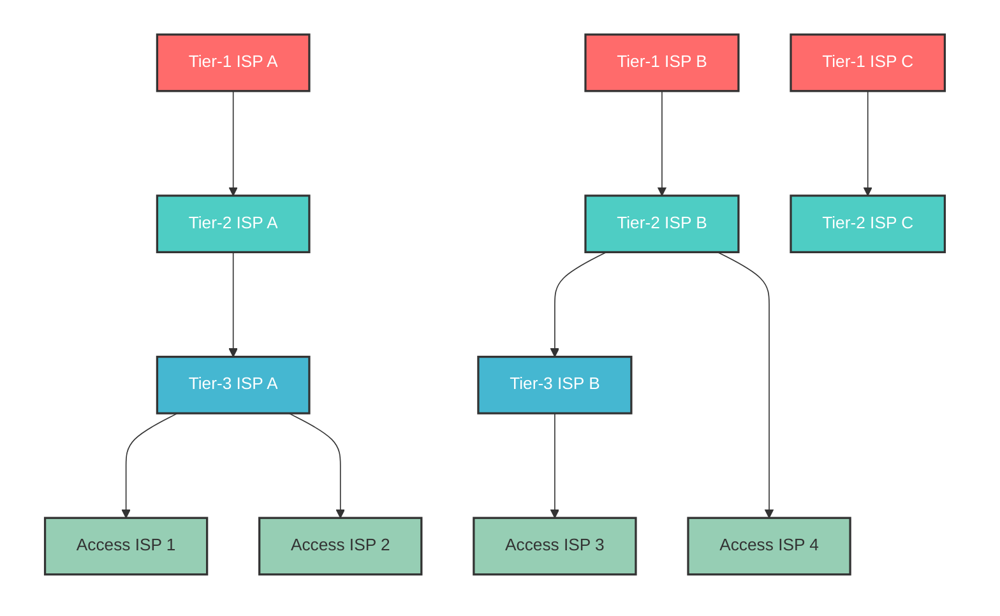

# Computer Networks - Overall Lecture Notes

## Overview of Computer Networks
### Components of Computer Networks
#### Components of the Internet
1. End systems: computers that are connected to the internet.
- e.g., web servers, mail servers, smartphones, and IoT devices.
- They are also called hosts.
- Distributed applications run (the same application runs while its parts are physically separate).
- Client process (CP) and server process (SP)
    - CP sends a request to SP to receive services (client-server model).
    - P2P (peer-to-peer) communication: Both CP and SP can run on end systems. The advantage of this communication is that if the SP does not have sufficient computing power, the SP can distribute files via many CPs.
2. Communication links: optical fiber, LAN cables, etc.
- Transmission rate of communication links: expressed by bandwidth and bps.
3. Router: repeater device of packets
4. Internet service provider (ISP)
- End systems access the internet via ISP.
- Many end-users make contracts with ISPs to be connected to the internet.
5. Protocols: Rules for communication between more than two communication entities, e.g., definitions of message forms, message order, and other actions.

#### Communication services
A system to send messages to each other between end systems
- Connection-oriented service: The simplest one
CP and SP send control packets to each other before transmitting data.
    - establish the connection by handshaking
    - connection-oriented: only end systems are concerned about the connection (not routers).

    **Reliable data transfer**
    No error and no out-of-order data. The reliability is realized by using ACK.

    **Flow control**
    Control transmission rate between each endpoint (ensure not to overflow the receiving capacity of the receiver).

    **Congestion control**
    Prevent network congestion, or resolve congestion situations. It also controls the transmission rate to realize this goal.

    **TCP (Transmission Control Protocol)**
    The connection-oriented service on the internet
    - Lots of internet applications (SMTP, HTTP, FTP, etc...) use TCP
 - **Connectionless services**
No handshake (transmit when wanted). No flow control and no congestion control.
    **UDP (User Datagram Protocol)**
    The connectionless service on the internet.
    - It is used by real-time applications (IP calls, video streaming services).
    ※ **QUIC**: A transport protocol developed by Google, working on UDP.

### Network Core
Routers that ensure connection between each end system.
#### Circuit Switching
In order to maintain communication between end systems, communication resources along the communication path are held continuously during a session.
Maintains good quality of communication!
**Multiplexing**
    - FDM: Frequency Division Multiplexing
    - TDM: Time Division Multiplexing
#### Packet Switching
It is different from circuit switching. Messages during a session may share resources.
*Packet*: A transmission unit in network core. Messages at the application level are broken down into this unit.
*Store-and-Forward transmission*: In each router, arrived packets are stored in a buffer first. Then, they are retransmitted following the ordering rules (determined in advance!).

(ex) The time for a packet that contains $L$-bit data to go through network via one router? (Each link can transmit at $R$-bps)

$$\frac{L}{R} + \frac{L}{R} = \frac{2L}{R}$$

It takes $\frac{NL}{R}$ time when a packet goes through $N$ links.

**Statistical multiplexing**
-> Dynamic assigning of bands

#### Circuit switching vs Packet switching
- Packet switching: Enables efficient use of transmission capacity.
- Circuit switching: Reserves connection in advance and thus it is good for real-time communication.

#### Delay and packet loss
Delay at each node
- Processing delay: The time to read the header of packets and determine the output link. It also includes transmission error checking. (normally under microseconds)

- Queueing delay: The time to wait for transmission. (normally less than 100 ms, but depends on buffer size)

- Transmission delay: The time to transmit a packet to a communication link. (depends on the capacity of the link $R$ bps and is a function of packet size $\frac{L}{R}$.)
- Propagation delay: The time that 1-bit of information takes to reach the next node. (slightly slower than the speed of light, about $2 \times 10^8$ to $3\times10^8$ [m/s])

Packet loss
Only a limited number of packets can enter a buffer. => Some packets may be lost. 
In general, there is a relationship that "Large buffer size" <=> "Long queueing delay and few packet losses".

#### Network of networks
The Internet is structured by hierarchically connected ISPs
- Access ISP: Access from end systems such as DSL, FTTH, cellular, Wi-Fi, and business LAN.
- Tier-1 ISP: Connects to other tier-1 ISPs and subordinate ISPs and covers global areas. They are also called the internet backbone.
    - AT&T, Verizon, NTT, Orange, etc.
- Tier-2 ISP (Wide area ISP), Tier-3 ISP (Local ISP)
    - Tier-2 ISPs communicate via tier-1 ISPs in the case of global communication. (transit communication)
    - Higher-tier ISPs are service providers and subordinate ISPs are customers. Payment is based on traffic usage.

- Peering: Connecting same-level ISPs in order to reduce transit fees

- IXP (Internet Exchange Point): Independent organizations that serve as a point where multiple ISPs do peering with each other. (JPNAP, JPIX, etc.)

- Content providers
    - Third parties with massive resources represented by Google.
    - They are also called hyper giants.
    - Directly peer with subordinate ISPs.

### Protocol layer and service models
#### Layered architecture
- The Internet is a complicated system.
    - Creating a layered architecture of protocols, hardware, and software => Reduces the complexity of the internet's design and clarifies the roles and relationships of each component.
- Each protocol belongs to one layer.
The $n$-th layer protocol sends messages only to others in the $n$-th layer.
    - $n$-PDU (Protocol Data Unit): messages that are sent in the $n$-th layer.
- Protocol stack 
The entire layer structure formed by these protocols.
    - OSI reference model: structured by 7 layers (Defined by ISO).
    - Internet (TCP/IP): structured by five layers.
- Service model
The $n$-th layer of host A transmits $n$-PDU to the $n$-th layer of host B
    - The $n$-th layer of host A hands the $n$-PDU to the $(n-1)$-th layer of host A, and requests transmission to the $n$-th layer of host B.

The $n$-th layer receives service from the $(n-1)$-th layer. The $n$-th layer does not concern itself with how these services are realized. => If **interfaces** between layers are defined in detail, each layer can be replaced.

#### Protocol layers of the internet

| Layer | Name | Roles |
|-------|------|-------------|
| L5 | Application | Support network applications |
| L4 | Transport | Provide communication between processes |
| L3 | Network | Provide end-to-end communication |
| L2 | Datalink | Provide node-wise communication in 1 hop |
| L1 | Physical | Provide bit-wise transmission |

## Application Layer Protocols

### Fundamentals

#### Application Layer Protocols

- Network application: Software that assumes the use of a network
    - e.g., Web applications consist of multiple software components such as browsers (Chrome, Safari, etc.) and web servers (Apache, etc.)

- Application layer protocol: A part of network applications
    - Defines how messages are exchanged and the types/formats of messages
- Network applications generally have both client and server aspects (e.g., the relationship between web browsers and web servers)
- Inter-process communication via networks
    - Communication between processes on two end systems via a network
    - Uses a virtual interface called a socket
    - A socket is also called an API (Application Programming Interface)
    - More specifically, it is the interface between the application layer and the transport layer
- Connection (flow) unit (information assigned by the application layer)
    - IP addresses of sending and receiving hosts
    - Port numbers of sending and receiving processes
        - Determines which process within a host to deliver to
        - The server-side port number must be known in advance by the client.
        - Server-side port numbers for representative application layer protocols are reserved (**Well-Known ports**)
        - e.g., HTTP: 80, SMTP: 25, DNS: 53, etc.

#### Services Provided by the Transport Layer

- **TCP Service**
    - Connection-oriented: Full-duplex TCP connection, communication after handshaking
    - Reliable data transfer: Guarantees communication without transmission errors and maintains correct packet order
    - Congestion control, flow control: Transmission rate varies depending on the network situation
- **UDP Service**
    - Minimal data transfer service: Does not guarantee packet order or reliable arrival
    - Connectionless: No handshaking
    - No congestion control or flow control: Transmission rate is determined by the sending process

Examples:

| Application | Application Layer Protocol | Transport Layer Protocol |
|-------------|----------------------------|--------------------------|
| Email | SMTP | TCP |
| Remote access | Telnet, SSH | TCP |
| Web | HTTP | TCP |
| File transfer | FTP | TCP |
| Streaming audio/video | Individual protocols or HTTP (YouTube) | UDP/TCP |
| IP telephony | Individual protocols | Mostly UDP |

#### Classification of Application Layer Protocols

- **Pull-type and Push-type**
    - Pull-type protocols
        - HTTP, FTP, etc.
        - Users pull information as needed
    - Push-type protocols
        - SMTP, etc.: The sender pushes information to the recipient
- **Out-of-band and In-band**
    - Out-of-band method
        - Uses separate connections for control and data
        - e.g., FTP
    - In-band method
        - Uses the same connection for control and data
        - e.g., HTTP

※ The concept of out-of-band exists in various scenarios
- OpenFlow (Software for Software-Defined Networking (SDN))
- C/U separation in 5G (Phantom cell)
    - Macro cell transmits control signals
    - Small cell performs high-speed data transfer

### Web and HTTP

#### Overview of HTTP

HTTP (Hypertext Transfer Protocol): Application layer protocol for the Web
- Web object: Content such as HTML files, various images, JavaScript, audio/video, etc.
- Web page: A collection of a base HTML file and several web objects (URL includes hostname, pathname, and filename)
- Web browser: HTTP client that displays web pages
    - e.g., Edge, Safari, Chrome, Firefox
- Web server: HTTP server that stores web objects
    - e.g., Apache
- HTTP operation: Defines how web clients (browsers) request web pages from web servers and how servers transfer those pages to clients

First, the browser sends an HTTP request message, and the server returns an HTTP response

- Transport layer protocol is TCP
- Stateless protocol
    - Server does not store client history information
    - Lightweight control, can handle many HTTP connections simultaneously

#### Non-persistent connection and Persistent connection
- Non-persistent connection
    - It transfers one web object within one TCP connection.
    - It is used in HTTP/1.0
    - Normally, a browser can maintain 5 - 10 TCP connections in parallel. However, in case they are fully used, each object is transferred one by one.
- Weak points of non-persistent connection:
    - The server has to control many TCP connections and thus it uses many resources
    - Each object requires 2 RTT (1 RTT for connection establishment). RTT (round trip time): Delay time between a client and a server.
- Persistent connection
    - It transfers multiple web objects within one TCP connection.
    - It is used by default in HTTP/1.1
    - A server keeps the TCP connection open after a response
    - If the connection is not used within a designated time, the server closes the connection.
- Pipeline processing
    - Non-pipeline processing:
    A client receives a response, then sends another request. (The server becomes idle for a while after it responds.)
    - Pipeline processing:
    A client sends a request before it receives a response to previous requests. The server processes multiple objects. (Used in HTTP/1.1)
  
#### HTTP message
- There are two types of HTTP messages: Request and response
Elements of a request message
    - Request line: HTTP method (GET, POST, HEAD, etc.), request target (URL), HTTP version.
    - Header lines: Stores user agents (iOS or Windows, Safari or Chrome, etc.) in key:value form
    - Body

Elements of a response message
    - Status line: status code (200, 400, 500, etc.) + status strings
    - Header lines: Stores Via (such as proxy server) and Content-length (data size) in key:value form
    - Body

#### HTTP/2
The new version of HTTP which was documented in RFC in May 2015.
- **Stream**: The virtual bidirectional sequence of multiple requests and multiple responses within a connection
    - Multiplexing streams enables sending/receiving objects at the same time. (Solution to HoL blocking)
    ※ HoL (head of line) blocking issue: Large objects cause waiting because responses have to be returned according to request order.

- Compact HTTP header using HPACK
    - Send only differences after the second communication
- HTTP/2 frame: Communication using binary data in the form of *frames*.
    - Divide HTTP header and data into frames (it can also use header compression).
    - Frame division and compression is transparent to HTTP/1.x messages.
    (These are located below the HTTP layer. Application developers do not need to care about these changes.)
- Server push (Sends data for response to client in advance.)
- Priority control of streams.
- It can be used with protocols other than TCP.

#### HTTP streaming and DASH
**DASH** (Dynamic Adaptive Streaming over HTTP)
- A video is a sequence of images (24 or 30 frames/s)
- Encodes video file at several different bit rates
    - low-quality: 100kbps, streaming: 3Mbps, 4K: 10Mbps
- Divide videos into **segments** and store them on the server. (1 segment consists of several to tens of seconds of data)
- Clients determine which segments to request *dynamically*.
- An HTTP server contains the MPD (Media Presentation Description).
    - URLs of each version of segments are written.
    - Client first requests and fetches the MPD from the server.

### FTP (File Transfer Protocol)
It is a protocol for out-of-band method.
- controlling connection: port 21, persistent connection type
    - user authentication, password, commands such as cd, put and get
- data connection: port 20, non-persistent connection type
    - Transfer actual files

### E-mail
components
- User agent (mailer)
    - Outlook, Thunder bird, etc...
- Mail server
    - Post fix
- Protocol
    - SMTP (Simple Mail Transfer Protocol)
    - Mail access protocols
        - POP3, IMAP
Use SMTP in communications between a sending user agent and a server, or among servers.
Use mail access protocols between a mail server and an end user agent.

#### SMTP
Transfer message from the sending mail server to the receiving mail server
- Use 7 bits ASCII code as a data format
1. Client SMTP connects to port 25 of server SMTP using TCP
2. Handshake **in the application layer**
    (a) The client lets the server know the sender address, and the server responds with sending grant.
    (b) The client lets the server know the destination address, and the server notifies if the destination address actually exists. *In fact, mailer daemons occur due to this!*
3. The client notifies the start of data transport, and actually starts it soon after it receives the server's response.
4. Once transmission finishes, cut the connection
- TCP connection is persistent connection type.
    If there are multiple mails to one server, they are transported using only one connection.

#### Mail access protocol
The end user agent retrieves mail from the mail server.
- POP3 (Post Office Protocol ver.3)
    - Manages mails on client side
    - It is general to delete mail on server side after a designated term after finishing fetching the mail.
- IMAP (Internet Mail Access Protocol)
    - Manages mails on server side
    - Mail folder distribution and syncing sent mail between different terminals. (*It allows mails to have additional information such as folder, flag, etc.*)
- Recently, HTTP based web-based E-mails (Gmail) are mainly used. (It still uses SMTP for server-to-server communication. **User access uses HTTP**)

### DNS
DNS (Domain Name System)
- Hierarchical distributed database composed of name servers
- The application layer protocol that handles communication between hosts and name servers
- *Most system failures are due to DNS failures.*
#### Provided services
- Translate domain names into IP addresses **Name resolution**
- Registration of alias (another name) of host name and mail server name
- DNS round-robin (load distribution)
    - Matching set of the public host name and multiple mirror servers' IP addresses
    - Shifts the order of list after each request (The client uses the first address)
#### Structure of DNS
'DNS is a distributed database'
**Why isn't it a centralized system?**
- Lack of durability against failure (single point of failure)
- Access concentration to a server
- Much delay due to the need for remote access
- Complexity of maintenance and updates
**=> In summary, it is not scalable!**

Distributed model (classification of name servers)
- Root DNS server (There are only 13 "types")
    - It knows IP addresses of top-level DNS servers
    - In the past, 'there were only 13 of them', however they are multiplexed at present
- Top-level domain DNS servers
    - They manage top-level domains such as jp, com, edu
    - In general, they are managed and operated by an organization that is called 'registrar'
- Auth-DNS servers (Authoritative DNS servers)
    - They can translate host names (domain names) and IP addresses
    - Each host is registered in at least one auth-DNS server.
- (Local DNS server)
    - It is used by each organization such as schools, companies, etc.
    - Each host, at first, accesses the local DNS server that may cache data from the corresponding auth-DNS server

-  DNS iterative query and DNS recursive query
    - DNS iterative query: Clarify the name server which is in charge
    - DNS recursive query: Send name resolving requests to the name server
Normally, DNS recursive query is used between the end host to the local DNS server. Local DNS servers use DNS iterative query to handle name resolving requests.
- The local DNS server caches the information that are sent to hosts: **DNS cache**
    - Caches are deleted after designated time frame.
- DNS record
    - The distributed database which contains resource record (RR).
        - **zone file**: The set of RR that auth-servers control.
    - It is consist of 4 fields (name, value, type, ttl)
        - Type A record: name and value correspond to the host name and IP address (AAAA records for IPv6) respectively
        - Type NS record: name and value correspond to the domain name and its auth-server's host name respectively
        - Type CNAME record: Another name of a host name
        - Type MX record: Information about the mail server of the name

#### Attack against DNS server
**Cache poisoning**
1. An attacker requests name resolving to the DNS cache server
2. The DNS cache server does recursive query
3. An attacker instantaneously sends fake response (UDP segment)
4. The DNS cache server memorizes the fake domain and discards the true response from upper servers

**Requirements for the attack establishment**
- IP address is mimicked the requesting DNS server
- Use same port as query
- Use same ID (16 bits) as query
- Respond faster than the real DNS server

In fact, there are few chances for these attacks because chances appear only when the cache expires. (From this view point, some consider more effective attack.)

### Contents distribution
If contents are in only one server,
- Transmission delay increases
- Server loads also increase

**Contents distribution**
- Copy contents on multiple servers on the internet
- Find the server that can serve the contents the fastest to the user.

#### Web cache
web cache and proxy server.
- Respond to the HTTP request from clients instead of the original server
- Contains copies of objects that are accessed recently, on its own disc.
- If the web cache has the copy, users downloads it from the web cache.
    - Users send HTTP request to the web cache
    - If the web cache does not have the copy, it sends HTTP request to the original server.

#### CDN
CDN (Content Distribution Network)
- The business model that occurred in the late 90's.
(ex) Akamai: places 350k servers
- Each CDN service company places multiple CDN servers on the internet.
    - place CDN server intra ISP (internet service provider) or connect it to ISP
- Netflix and Youtube use their own private CDN for their services.
- Each CDN service company copies customers' contents on their own CDN servers (per each update).
    - Distinguish contents between those that are copied on their CDN server and those that are ignored.
    - The latter ones are transmitted to a **CDN distributing server**.
    - The CDN distributing server distributes the content to every single CDN server (uses exclusive channel).
    - The appropriate CDN server responds to the users' HTTP requests.
        - Based on routing table and estimated RTT (Round-trip time), each ISP registers the IP address of the CDN server that can realize the shortest response time.

(ex) contents provider: www.foo.com
CDN service company: www.cdn.com
- foo wants to serve only JPEG files using CDN
- foo replaces references all JPEG file in HTML objects, or designates CNAME in the DNS record.
1. Users send HTTP request to www.foo.com and receive a HTML file.
2. Read HTML file finding links such as http://www.cdn.com/www.foo.com/sports/a.jpg. Or, send query to foo.com again being redirected to cdn.com based on CNAME of DNS.
3. Ask IP address of www.cdn.com to the DNS.
4. The auth-server of cdn.com selects the appropriate CDN server for the user, and returns its IP address.
5. The browser sends HTTP request to the received IP address.
This IP address is memorized by DNS cache.

## Transport Layer
### Transport layer services
- Communicate with the application process to directly deliver a service
    - It is incorporated into end systems *(OS)* that have applications
    - It is not normally incorporated into routers in a network.
- Deliver **logical communication** between application processes
    - The application does not concern the structure of the physical communication infrastructure

#### Relationships between transport layers and network layers
- Network layers: Deliver logical communication between **hosts**
    - It is incorporated within routers that relay messages
- Transport layers make good use of packet delivery services by network layers

#### Transport layers of the Internet
- The minimum functions (Both TCP and UDP provide)
    - Transmitting services between processes (multiplexing and demultiplexing)
    - Error detection for segments
- UDP (User Datagram Protocol)
    - Connection-less service that does not ensure reliability
    - It only realizes the minimum functions
- TCP (Transmission Control Protocol)
    - The connection-oriented service that is highly reliable
    - It contains not only the minimum functions but also functions such as error correction, segment re-ordering and congestion control.

### Multiplexing and Demultiplexing
- Multiplexing: Lump data that are sent to the transport layer from various **sockets** together before handing them to the network layer
    Socket: Interface between application layer and transport layer
- Demultiplexing: Divide data that are handed from the network layer and send them to appropriate sockets

 - Port: Number used to distinguish sockets ($0 \sim 65535 = 2^{16} - 1$)
    - Ports $0 \sim 1023$ are reserved as well-known port numbers
    - The same number can be used differently for TCP and UDP
In general, a client randomly selects a port number (1024 and later) when creating a UDP/TCP socket. Conversely, a server normally uses a well-known port number.

#### Multiplexing and demultiplexing of UDP
- Client: Add start-point port number and end-point port number to the header (bind to a socket), then multiplex it
- Server: Select a socket based on the end-point port number (and end-point IP address)
    - Segments from different clients are handed to the same socket. The start-point port number is also used as the end-point port number of the reply.

#### Multiplexing and demultiplexing of TCP
- Client: Same as that of UDP
- Server: Select a socket based on the start-point IP address, start-point port number, end-point IP address, and end-point port number (all of them)

### UDP
- 8 byte header + payload (application layer message)

<table>
<tr>
<th colspan="2" align="center">← 32 bit →</th>
</tr>
<tr>
<td>start-point port number</td>
<td>end-point port number</td>
</tr>
<tr>
<td>segment length</td>
<td>check sum</td>
</tr>
<tr>
<td colspan="2" align="center">application layer message</td>
</tr>
</table>

 - Error detection is done at the receiver side using a checksum (1's complement of the result of adding all 16-bit words).
 - Do nothing else.

Merits
1. Data and transmission timing can be controlled at the application level
2. No need to establish a connection; thus, it is faster
3. Does not require connection control and thus imposes less load on servers
4. Smaller header size (8 bytes for UDP and 20 bytes for TCP)

### Reliable data transfer
- No bit errors and ordered data according to transmission order
- **ARQ (Automatic Repeat reQuest)**
    - The control mechanism for realizing reliable data transfer
    - Provide delivery confirmation and error detection to resend if needed

In the following, we consider requirements by making the situation more complicated, step by step
**Level 1: Packet corruption (bit errors) in the communication channel.** In this case, we need error detection and delivery confirmation.
- ACK (Acknowledgement): notifies if delivered correctly.
- NACK (Negative ACK): notifies if NOT delivered properly.
- **Stop-and-wait**
    - Send packets one by one
        - Receiver's buffer size is only 1
    - Send next packet only after receiving ACK/NACK

**Level 1.1: ACK/NACK can also be errored.** In this case, we cannot know if delivery succeeded. => Attach **a sequence number** to a packet to distinguish resent packets from new packets. In the case of stop-and-wait, sequence number does not have to be more than 1 bit.

**Level 1.2: Don't use NACK** If the sender gets ACK for same sequence number twice, its effect is same as NACK. => **duplicate ACK**

**Level 2: Packet loss communication channel** 
- In this case, packet may not arrive at the opponent side. => set **time out term**.
- If the sender may not receive ACK in the designated time out term, it is considered as the failure and resends it.
- Time out term has to be longer than delay term.

#### Stop-and-wait (SW)
- The sender side
    - Attach sequence number (1 bit) to each packet.
    - Set time out term
1.  Send packets by order
2. Wait till receive ACK
    2.1 Receive ACK in time out term => go to 1
    2.2 If not, go to 1 (resend)

- The receiver side
1. Once receive a packet, check if there are errors.
2. If not, send ACK packet with the sequence number.
    
- The base performance of SW (without any error, ignore transfer delay of ACK)
    - Packet length: $L$ (bit), channel speed $R$ (bps), round trip delay $RTT$ (s)

**Time for transferring one packet**
$$RTT + \frac{L}{R}$$

**Through put**
$$\theta = \frac{L}{RTT + \frac{L}{R}}$$

**channel occupied rate**
$$U = \frac{\theta}{R} = \frac{L}{R \times RTT + L}$$
※ $R \times RTT$: Bandwidth delay product (BDP)

If BDP increases, channel usability decreases.

### Go-Back-N (GBN)
- Can send successive maximum $N$ packets without waiting for ACK receival. => sliding window protocol
- If communication failure (error, loss, order change) occurs, return to the packet and do it again.
※ Receiver's buffer size is 1, failed packets are discarded.

- The sender side
    - Attach sequence number to each packet ($k$ bits)
    - Configure the window size ($N<2^k$) and time out term.
    - $F$ number of packets that are sent but ACK is not received.
1. Send packets following order until $N=F$.
2. Wait for ACK of each packet
    2.1 Receive ACK in time out term, go to 1.
    2.2 If not, go to 1 to resend packets after the packet (includes that packet as well)

- The receiver side
1. Once catch a packet, check if 
    - it has error
    - correct order
2. No error, correct order => send back ACK with respective sequence number. If not, discard the packet and send back ACK with sequence number of the last correct packet.

**Cumulative ACK** The concept that packets before the largest correct sequence number are all correctly received.

### Selective Repeat (SR)
- How SR protocol works
    - Send up to $N$ successive packets without waiting for ACK.
    - Receiver's buffer size is $N$.
    - If sending failures are detected, resend only the packet.
- Sender side
    - Attach sequence number ($k$ bit) to a packet.
    - Register window size $N (N \leq 2^{k-1})$ and time out period.
    - $n$: The smallest sequence number of a packet that is sent but ACK not received.
  
1. Send successive $n+N-1$ packets.
2. Wait for ACK until time out period.
2.1. If the sender receives ACK in time, go to 1.
2.2. If it is time out period, resend the packet and go to 2.

- Receiver side
1. If catching a packet, check if it contains error.
2. If there is no error, send back ACK with its sequence number.

## TCP
TCP (Transmission Control Protocol)
- Connection-oriented reliable transport protocol on Internet.
- There are various minor-changed models
- Realization of basic action rules depends on how it is implemented.

### TCP connection and TCP segment
- Full duplex
- point to point
- Segment unit transport
    - Segment = TCP header + AP layer data
    - Maximum segment size (MSS)
        - The maximum size of AP layer data in a segment
        - e.g., 1460 bytes for Ethernet LAN.
- Control information included in header
  - start/end point port number
  - sequence number, ACK number
  - SYN, FIN, ACK flags

  - sequence number: byte unit successive number
      - corresponds to the first byte of transmitted data
      - starts with random number (to detect scam)
  - ACK number: sequence number that corresponds to the **next byte that should be received next**. => **Cumulative ACK** : ALL bytes before the ACK number are received successfully

**Connection establishment**: 3-way hand shake
1. The client sends SYN segment with initial value of sequence number.
2. The server sends back SYN segment with the initial value of the sequence number and ACK for received segment.
3. The client sends ACK segment with ACK number for the received SYN/ACK segment.

**Connection end**
1. A side that wants to end the connection (A) sends FIN segment to the other (B).
2. Once B receives FIN segment, send back ACK segment to A.
3. If B has any further data, connection still continues.
4. If there isn't any further data, B sends FIN segment to A.
5. A sends ACK for received FIN segment and becomes waiting status.
6. B cuts the connection after receiving the ACK segment. (If time out, resend FIN segment)

<u>Delayed ACK</u>
By delaying ACK, make good use of bandwidth.
<u>Implementation example of TCP ACK</u> (There are no explicit rules in RFC)
1. Send segments in correct order, and there are no segments in "waiting for ACK sending" status, Postpone ACK sending for up to 500 ms, within this period, if the following 2,3 do **not** occur, send ACK.
2. Send segments in correct order and there are segments in "waiting for ACK sending", send cumulative ACK for two segments right away.
3. Receive segments with unexpectedly larger sequence number, send duplicate ACK for expected sequence number.

4. When receiving segments that fill loss part of received data, if it contains the smallest number of loss part, send ACK.

- Selective ACK option (SACK)
    - Configure when to send a SYN segment
    - When to send duplicate ACK, also send information about correctly received segments. (First and last byte number of correctly received block)

## Congestion control
### The principle of congestion control
- Congestion: The situation where too many packets exist in a network.
    - When the number of transmitted packets is less than what the network can handle => Delivered packet number (throughput) is the same as the transmitted packet number.
    - When the number of transmitted packets is more than the network capability => Retransmitted packets make the congestion status worse and thus throughput decreases.

- An ideal congestion control
    - Situation where there are NOT too many packets => Throughput increases linearly as packets increase.
    - Situation where there are many packets => Throughput stays within the network capacity.

### Congestion control by TCP
- **Window control**: Each client can transmit packets up to designated window size.

- **Bandwidth Delay Product (BDP)**
$$ \text{BDP} = \text{BW} \times \text{RTT} $$
    - BW : The minimum transmission speed of links on a path.
    - RTT : Round trip time

- If the window size is smaller than the BDP, the transmission path is not sufficiently used.

**Requirements for TCP congestion control**
- Increase the window size quickly up to the BDP
- When congestion occurs, do not let the window size become too small compared to the BDP.

#### Window size control
- Congestion window: The maximum byte size that can be transmitted without waiting for an ACK for a previous packet.

- Distinguish two domains using ssthresh.
    - $\text{cwnd} < \text{ssthresh}$ : **slow start** mode.
    - $\text{cwnd} \geq \text{ssthresh}$ : **congestion avoidance** mode.

1. While $\text{cwnd} < \text{ssthresh}$, $\text{cwnd}$ increases exponentially.
2. After it becomes $\text{cwnd} \geq \text{ssthresh}$, $\text{cwnd}$ increases linearly.
3. Once congestion is detected, $\text{cwnd}$ decreases.
    - Loss detection via timeout
    - Loss detection via multiple (more than three) ACK receptions.

**Slow start**
After connection establishment, do slow start first (increase $\text{cwnd}$ quickly).
- The initial value of $\text{cwnd}$ is 1 maximum segment size (MSS)
- After each ACK reception, increment $\text{cwnd}$ by 1 MSS.

**Congestion avoidance**
Increase rate gradually as ACKs are received.
- Once an ACK is received,
$$\text{cwnd} \longleftarrow \text{cwnd} + \frac{\text{MSS}}{\text{cwnd}} \times \text{MSS}$$

- Transmission rate increases linearly.

### Congestion detection
By detecting packet loss, we can detect congestion.

**Retransmission Timeout**
If an ACK for the transmitted segment is not received within the designated time frame, consider it a packet loss.

- Configuration of the timeout interval: it is calculated based on the RTT of the segment.
    - Timeout interval < RTT => Unreasonable retransmission.
    - Timeout interval >> RTT => degrades performance.

RTT depends on each connection and may vary over time.

**Estimating RTT**
- RTT: The time between handing a segment to the network layer (IP) and receiving it
    - MRTT: Measured RTT
    - ERTT: Estimated RTT. The following update rule (exponentially weighted average) is often utilized:
$$\text{ERTT} \longleftarrow (1-\alpha)\text{ERTT} + \alpha\text{MRTT}$$
    - $\alpha=\frac{1}{8}$ for many implementations.
    - Retransmitted packets are excluded from the measurement.

- DevRTT: Variability of RTT, updated by the following rule:
$$\text{DevRTT} \longleftarrow (1-\beta)\text{DevRTT} + \beta |\text{MRTT}-\text{ERTT}|$$
    - $\beta=\frac{1}{4}$ is used in many implementations.

- **RTO**
$$\text{RTO} = \text{ERTT} + 4\text{DevRTT}$$
If RTT follows a Gaussian distribution, $\text{Pr}(\text{RTT}>\text{RTO}) \simeq 3.17 \times 10^{-5}$. In some cases, implementations "double the timeout interval for retransmitting a packet." 

**Fast retransmission**
In many cases, RTO is much larger than RTT. => It takes a long time to detect packet loss because of the retransmission timeout.

In fast retransmission, due to **duplicate ACKs**, we can detect congestion early.
- If we receive three duplicate ACKs for a segment, without waiting for the timeout, we retransmit the segment whose ACK was not received.

**TCP Tahoe**
- Increasing window: slow start + congestion avoidance.
- Congestion detection: Retransmission timeout + fast retransmission.
- If congestion is detected, set
$$\text{ssthresh} \leftarrow \frac{1}{2} \text{cwnd},\\ \text{cwnd} \leftarrow 1$$

**Fast recovery**
If fast retransmission occurs, at least three successive segments are received by the receiver side. => congestion is not fatal, so setting $\text{cwnd}\leftarrow 1$ is inefficient.

- Fast recovery: avoid extreme degradation of throughput.
    1. After receiving the third duplicate ACK, set $\text{ssthresh}\leftarrow \frac{1}{2} \cdot \text{cwnd} $ and retransmit. After that, set $\text{cwnd}\leftarrow \text{ssthresh} + 3\text{MSS}$.

    2. After each reception of a duplicate ACK, update as $\text{cwnd}\leftarrow\text{cwnd}+\text{MSS}$.

    3. If an ACK is received for the previously unacknowledged segment (update ACK number), update as $\text{cwnd}\leftarrow\text{ssthresh}$

**TCP Reno**
- Increasing window size: slow start + congestion avoidance
- Congestion detection: retransmission timeout + fast retransmission
- If congestion is detected, resume with fast recovery.
- In the case of a retransmission timeout, resume with $\text{cwnd}=1$.

AIMD (Additive-increase/Multiplicative-decrease)
- AI for congestion avoidance mode
- If three duplicate ACKs are received, multiplicative decrease is employed

## Network Layer

### Dynamic host configuration protocol (DHCP)
- It dynamically assigns IP addresses to the host and notifies them information about network configuration.
It is a client-server type application-layer protocol that uses UDP
- Server: DHCP server (can be multiple, port number: 67)
- client: Host that is newly connected to the network (port number: 68)

The basic flow
1. DHCP server discovery: The client broadcasts *DHCP discovery message*
2. DHCP server offer: The DHCP server broadcasts to reply assigned IP address and expiring term
3. DHCP request: The client selects a server and echo back the IP address about to be used
4. The server sends ACK with network configuration information
Hosts acquire the new IP address everytime they change the network to connect

### IPv6
It is installed as a countermeasure against an address depletion of IPv4

**Added features from IPv4**
- Extended Address space
    - 32 bits to 128 bits
- Any cast address
    - Communicate with any one of host in a host group
- 40 bytes fixed length header
     Fast packet processing
- Detailed classification of packets based on flow label and traffic class

**Deleted features (ALL RELATED TO FAST PACKET PROCESSING)**
- Fragmentation
    - It can be performed only at starting node (path MTU search)
    - If it cannot be transported, is discarded and notify that to the starting point server
- Header check sum
    - Trust upper and lower layers and is not performed in IPv6
    - Hop-wise recalculation because of change of TTL is omitted
- Option
    - Fixed length header
    - Prepare many options using *next header field*

### Principle of routing
Routing algorithm: solution of *shortest path problem (SPP)*
given condition: 
- Network topology
- Each link's cost
Objective: Find a path that minimizes the sum of link costs

**Formulation of SPP**
$\mathcal{V}$: set of nodes 
$\mathcal{E}$: set of edges
$c(i,j)$: cost of link $(i,j)$
$s \in \mathcal{V}$: start node
$d \in \mathcal{V}$: end node
$x(i,j)$ 1 if used, 0 otherwise

$$
\text{minimize}~\sum_{(i,j)\in\mathcal{E}} c(i,j)x(i,j) \\
\text{subject to}~x(i,j) \in \lbrace 0,1\rbrace,~\sum_{(s,j)\in\mathcal{E}}x(s,j)=1,~\sum_{(i,d)\in\mathcal{E}}x(i,d)=1,~\sum_{(i,j)\in\mathcal{E}}x(i,j)-\sum_{(j,k)\in\mathcal{E}}x(j,k)=0~\text{for}~j\in\mathcal{V}-\lbrace s,d\rbrace
$$
where the last constraint means if it includes a link that into node $j$, it also has to include the link from node $j$.

- Dijkstra algorithm
    - Concentration type, there is only one start node $s$ and others are end nodes
- Bellman-Ford algorithm
    - Distributed async (cooperative) type
    - Exchanging information with adjacent nodes to make the path
