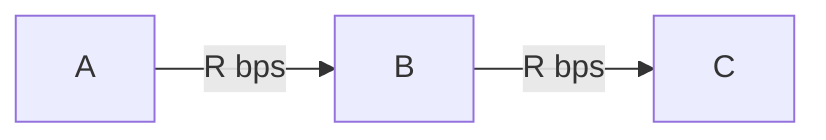

## Overview of Computer Networks
### Components of Computer Networks
#### Components of the Internet
1. End systems: computers that are connected to the internet.
- e.g., web servers, mail servers, smartphones, and IoT apparatuses.
- They are also called hosts.
- Distributed applications run (the same application runs while its parts are physically separate).
- Client process (CP) and server process (SP)
    - CP sends a request to SP to receive services (client-server model).
    - P2P (peer-to-peer) communication: Both CP and SP can run on end systems. The advantage of this communication is that if the SP does not have sufficient power to communicate, the SP can distribute files via many CPs.
2. Communication links: optical fiber, LAN cables, etc.
- Transmission rate of communication links: expressed by bandwidth and bps.
3. Router: repeater device of packets
4. Internet service provider (ISP)
- End systems access the internet via ISP.
- Many end-users make contracts with ISPs to be connected to the internet.
5. Protocols: Rules for communication between more than two communication entities, e.g., definitions of message forms, message order, and other actions.

#### Communication services
A system to send messages to each other between end systems
- Connection-oriented service: The most simple one
CP and SP send control packets to each other before transmitting data.
    - establish the connection by handshaking
    - connection-oriented: only end systems concern about connection (not for routers).

    **Reliable data transfer**
    No error and no order-error data. The reliability is realized by using ACK

    **Flow control**
    Control transmission rate between each endpoint (ensure not to overflow receiving ability of the receiver).

    **Congestion control**
    Refrain from network congestion, or resolve congestion situations. It also controls the transmission rate to realize the goal.

    **TCP (Transmission Control Protocol)**
    The connection-oriented service on the internet
    - Lots of internet applications (SMTP, HTTP, FTP, etc...) use TCP
 - **Connection-less services**
No handshake (transmit when wanted). No flow control and congestion control.
    **UDP (User Datagram Protocol)**
    The connection-less service on the internet.
    - It is used by real-time applications (IP call, video streaming services).
    ※ **QUIC**: A transport protocol developed by Google, working on UDP.

### Network Core
Routers that ensure connection between each end system.
#### Circuit Switching
In order to maintain communication between end systems, holding communication resources along communication path always during a session.
Maintain good quality of communication!
**Multiplexing**
    - FDM: Frequency Division Multiplexing
    - TDM: Time Division Multiplexing
#### Packet Switching
It is different from circuit switching. Messages during session may share resources
*Packet*: A transmission unit in network core. messages on application level are broken down into this unit.
*Store-and-Forward transmission*: In each router, arrived packets are contained in buffer at first. Then, they are re-transmitted following the order rules (determined in advance!).

(ex) The time for a packet that contains $L$-bit data to go through network via one router? (Each link can transmit at $R$-bps)

$$\frac{L}{R} + \frac{L}{R} = \frac{2L}{R}$$

It takes $\frac{NL}{R}$ time when a packet goes through $N$ links.

**Statistical multiplexing**
-> Dynamic assigning of bands

#### Circuit switching vs Packet switching
- Packet switching: Enabling efficient use of transmission capacity.
- Circuit switching: Reserve connection in advance and thus it is good for real-time communication.