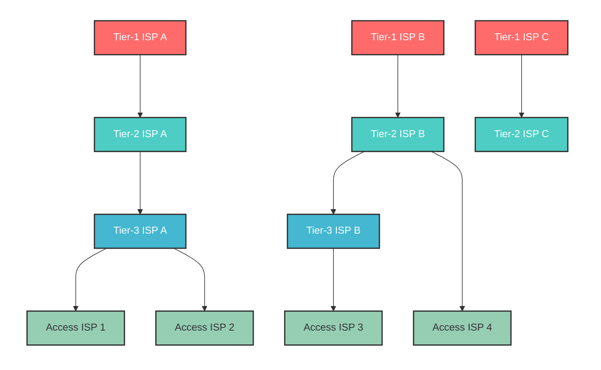

#### Delay and packet loss
Delay at each node
- Processing delay: The time to read the header of packets and determine the output link. It also includes transmission failure check. (normally under microseconds)

- Queueing delay: The time to wait for transmission. (normally less than 100 ms, but depends on buffer size)

- Transmission delay: The time to transmit a packet to a communication link. (depends on the capacity of link $R$ bps and is a function of packet size $\frac{L}{R}$.)
- Propagation delay: The time that 1-bit information takes to reach the next node. (a little bit slower than the speed of light, about $2 \times 10^8$ to $3\times10^8$ [m/s])

Packet loss
Only a limited number of packets can enter a buffer. => Some packets may be lost. 
In general, there is a relationship that "Large buffer size" <=> "Long queueing delay and few packet losses".

#### Network of networks
The Internet is structured by hierarchically connected ISPs
- Access ISP: Access from end systems such as DSL, FTTH, cellular, Wi-Fi, and business LAN.
- Tier-1 ISP: Connect to other tier-1 ISPs and subordinate ISPs and cover global areas. They are also called the internet backbone.
    - AT&T, Verizon, NTT, Orange, etc.
- Tier-2 ISP (Wide area ISP), Tier-3 ISP (Local ISP)
    - Tier-2 ISPs communicate via tier-1 ISPs in the case of global communication. (transit communication)
    - Higher ISPs are service providers and subordinate ISPs are customers. Pay-for-use based on traffic

- Peering: Connecting same-level ISPs in order to reduce transit fees

- IXP (Internet Exchange Point): Independent organizations that serve as a point where multiple ISPs do peering with each other. (JPNAP, JPIX, etc.)

- Content providers
    - Third parties with massive resources represented by Google.
    - They are also called hyper giants.
    - Directly peer with subordinate ISPs.

### Protocol layer and service models
#### Layered architecture
- The Internet is a complicated system.
    - Create layered architecture of protocols, hardware, and software. => Reduce the complexity of the design of the internet and clarify roles and relationships of each component.
- Each protocol belongs to one layer.
$n$-th layer protocol sends messages only to others in the $n$-th layer.
    - $n$-PDU (Protocol Data Unit): messages that are sent in the $n$-th layer.
- Protocol stack 
The whole layer structure formed by these protocols.
    - OSI reference model: structured by 7 layers (Ruled by ISO).
    - Internet (TCP/IP): structured by five layers.
- Service model
The $n$-th layer of host A transmits $n$-PDU to the $n$-th layer of host B
    - The $n$-th layer of host A hands the $n$-PDU to the $n-1$-th layer of host A, and requests transmission to the $n$-th layer of host B.

The $n$-th layer receives service from the $n-1$-th layer. The $n$-th layer does not concern itself with how these services are realized. => If **interfaces** between layers are defined in detail, each layer can be replaced.

#### Protocol layers of the internet

| Layer | Name | Roles |
|-------|------|-------------|
| L5 | Application | Support network applications |
| L4 | Transport | Provide communication between processes |
| L3 | Network | Provide end-to-end communication |
| L2 | Datalink | Provide node-wise communication in 1 hop |
| L1 | Physical | Provide bit-wise transmission |
